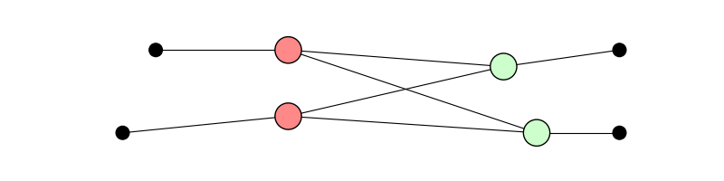

# ZXdb: ZX-calculus on graph databases

## Note on styles in MemGraph

Apply the following style definitions for MemGraph to match the style with PyZX:

```
@NodeStyle Equals(Property(node, "t"), 0) {
  color: #000000
  color-hover: #000000
  color-selected: #000000
}

@NodeStyle Equals(Property(node, "t"), 1) {
  color: #d6fccf
  color-hover: #d6fccf
  color-selected: #d6fccf
}

@NodeStyle Equals(Property(node, "t"), 2) {
  color: #f0908a
  color-hover: #f0908a
  color-selected: #f0908a
}

@NodeStyle Equals(Property(node, "t"), 3) {
  color: #ffd700
  color-hover: #ffd700
  color-selected: #ffd700
}
```

## Notes on differences compared to PyZX:
* There is possibility to perform spider fusion when red and green spider are connected with a Hadamard edge. As far as I know, ``spider_simp`` in PyZX does not detect these cases.
* ``Bialg_simp`` is not clearly explained in the PyZX. I understand that it is the ''inverse'' of the bialgebra rule applied to all non-interacting instances. If this is the case, the matching function ``match_bialg_parallel`` does not seem to find all instances. For example, the following instance does not get optimized:

 